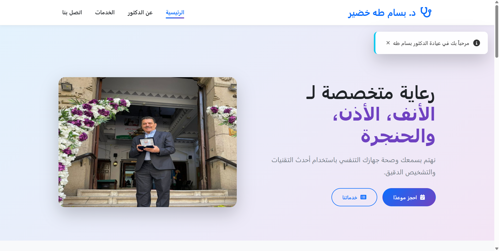
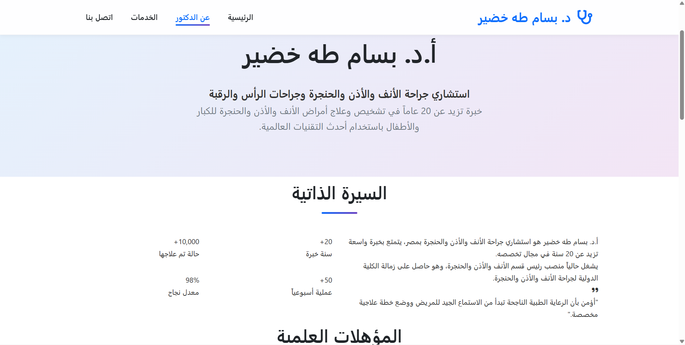
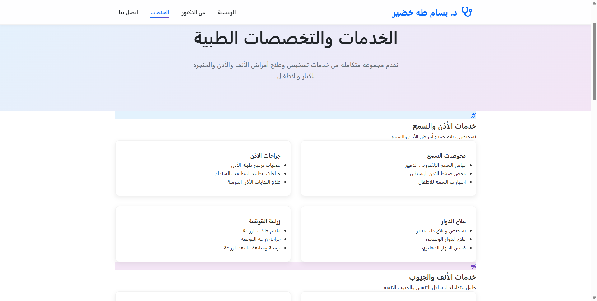
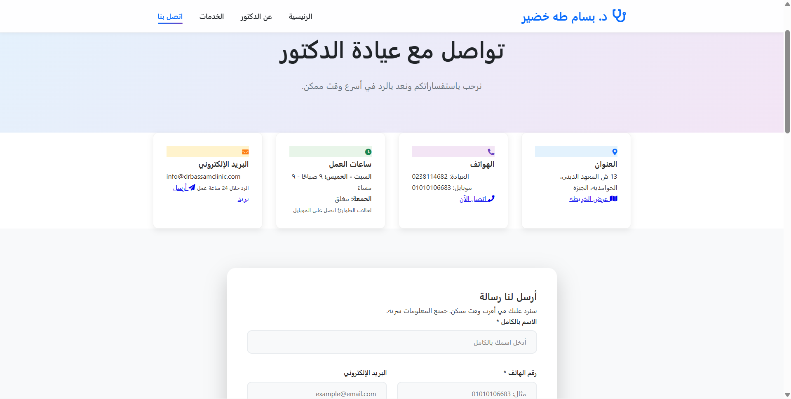

# Dr. Clinic Website

A multi-page frontend website for a clinic.  
The project provides information about the clinic, services offered, and a contact page for patients.

## 🚀 Live Demo
(Will be added after enabling GitHub Pages)

## 🛠️ Technologies Used
- HTML5
- CSS3
- JavaScript (Vanilla JS)

## 📌 Features
- Home page with hero section
- About page
- Services page
- Contact page with form
- Responsive design
- Simple JavaScript interactions

## 📂 Project Structure
dr-clinic-site/
├─ index.html
├─ about.html
├─ services.html
├─ contact.html
├─ assets/
│  ├─ images/
│  │  └─ hero-doctor.jpeg
│  ├─ css/
│  │  └─ style.css
│  └─ js/
│     └─ main.js

## 📷 Screenshots

### Home Page

### About Page

### Services Page

### Contact Page

## 👨‍💻 Author
Mahmoud Riizk

## 📄 License
This project is for educational purposes.
